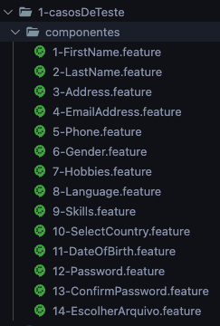
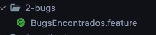

## CYPRESS - Automation Demo Site - Para Desafio para Vaga de QA junior
> Tachyonix
#
<p align="center">
    
</p>
<h1 align="center"> Escrita de casos de teste + Automação, do site Automation Demo Site na aba (Register) </h1>

## Descrição do Projeto


- [X] Etapa-1: Os testes deverão cobrir somente a página de register : https://demo.automationtesting.in/Register.html 
    - Esta etapa foi construida dentro da pasta (1-casosDeTeste > componentes) e (1-casosDeTeste > e2e)
    - Lá são abordados todos os possíveis testes em todos os componentes e e2e do formulário da página Register
<p aling="center">
    
</p> 

<p aling="center">
    
</p> 
        
- Bônus-1: Tomei a liberdade de apontar alguns bugs encontrados e estão reportados na pasta (2-bugs) 
<p aling="center">
    
</p>

- Bônus-2: Tomei a liberdade de apontar algumas melhorias que pude ver estão na pasta (3-melhorias) 
<p aling="center">
    
</p>

- [X] Etapa-2(opcional): Automação dos testes
    - Projeto construido em JavaScript + Cypress , voltado a recriar fluxos E2E

<h1 align="center">
    <p align="center">Página para consulta</p>
    <a href="https://www.cypress.io/"> Cypress </a>
</h1>

## Status do projeto

<p align="center">
    
</p>

## Pré-requisitos

Antes de começar, você vai precisar ter instalado em sua máquina as seguintes ferramentas:
[Git](https://git-scm.com), [Node.js](https://nodejs.org/en/) e um bom editor para interpretar o código [VSCode](https://code.visualstudio.com/).

## Clonando e instalando o projeto

- Clone o repositório do projeto com o comando abaixo 
````
$ git clone https://github.com/AndreSektor/desafio-automation_demo_site.git
````

# Acesse a pasta do projeto com a ferramenta do VScode e instale as dependências com o comando abaixo
````
$ npm install
````

## CT- Casos de teste construídos 
# Testes de componentes

- [X] First Name       / Desenvolvido   
- [X] Last Name        / Desenvolvido
- [X] Address          / Desenvolvido
- [X] Email Address    / Desenvolvido
- [X] Phone            / Desenvolvido
- [X] Gender           / Desenvolvido
- [X] Hobbies          / Desenvolvido
- [X] Languages        / Desenvolvido
- [X] Skills           / Desenvolvido
- [X] Select Country   / Desenvolvido
- [X] Data Of Birth    / Desenvolvido
- [X] Password         / Desenvolvido
- [X] Confirm Passowrd / Desenvolvido
- [X] Escolher Arquivo / Desenvolvido 

## AUTOMAÇÃO E2E
- [X] Register  / Funcionando
- [X] ClearForm / Funcionando

## Arquitetura das pastas
> 1-casosDeTeste "Pasta responsável por documentar os teste de componentes e fluxos e2e"

> 2-bugs "Pasta responsável por documentar os bugs encontrados na plataforma"

> 3-melhorias "Pasta responsável por documentar as possíveis melhorias do menu Register"

> cypress "Automação"

## 🎲 Rodando os testes
> Projeto conta com arquivo Makefile para fascilitar execução  

- Com o terminal aberto
- Digite o seguinte comando
- MacOS:
    - Interface
````
$ make open
````
- Windows:
    - Interface   
````
$ npx cypress open
````

- Escolha um teste E2E(1-register ou 2-clearForm)
- Assista a execução da automação
- Caso deseje rodar em headless
- MacOS
````
$ make headless
````
- Windows
````
$ npx cypress run
````

## O projeto conta com execuções de teste no Github Actions
> End-to-end Tests 🧪(Chrome : Microsoft Egde)
> Pode ser acionado atravez de inserções por meio de PUSH no código
- Para acessar o resultado da execução no GithubActions acesse a URL do repositório(ACTIONS > End-to-end Tests 🧪)

## Autor 👋 

[<br><sub>André Luís</sub>](https://github.com/AndreSektor)
